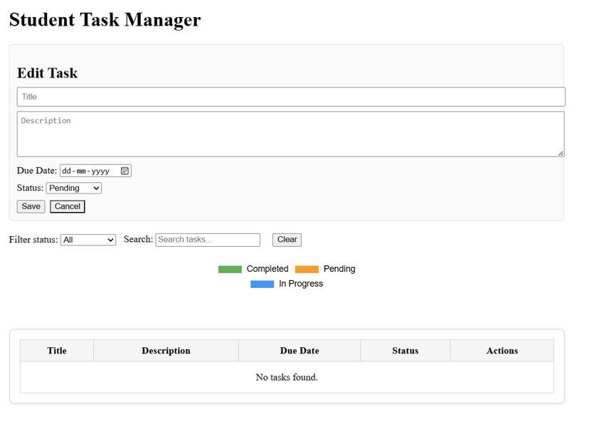
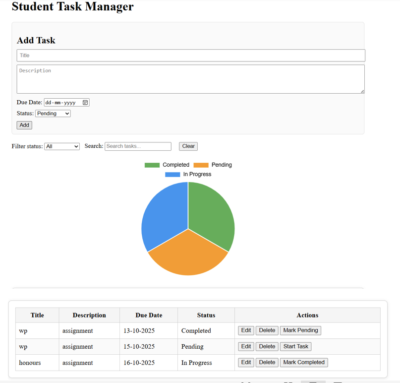
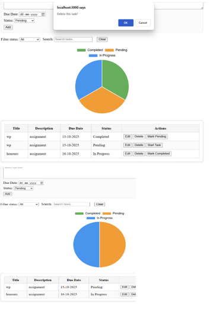

# Student Task Manager

A simple **React + Node.js/Express + MongoDB** application to manage student tasks.  
It allows users to **create, edit, delete, and track tasks** with statuses and due dates. The app also features a **task status chart** and search/filter functionality.

---

## Features

- Add new tasks with **title**, **description**, **due date**, and **status**.
- Edit existing tasks.
- Delete tasks.
- **Toggle task status** (Pending, In Progress, Completed) with a single click.
- Search tasks by title or description.
- Filter tasks by status.
- View a **status chart** for an overview of task progress.
- Fully responsive design for desktop and mobile.

---

## Screenshots

  
  


*(Add your own screenshots in the `screenshots` folder.)*

---

## Technologies Used

- **Frontend:** React, HTML5, CSS3  
- **Backend:** Node.js, Express (or Django if used)  
- **Database:** MongoDB  
- **Charts:** Recharts or Chart.js  
- **Version Control:** Git, GitHub

---

## Installation

1. **Clone the repository:**

```bash
git clone https://github.com/sancia-123/student-task-manager.git
cd student-task-manager

2. **Install frontend dependencies:**
cd frontend
npm install

3. **Install backend dependencies:**
cd ../backend
npm install

4. **Start the development servers:**
# Frontend
cd frontend
npm start

# Backend
cd backend
npm run dev

Open http://localhost:3000 in your browser.
